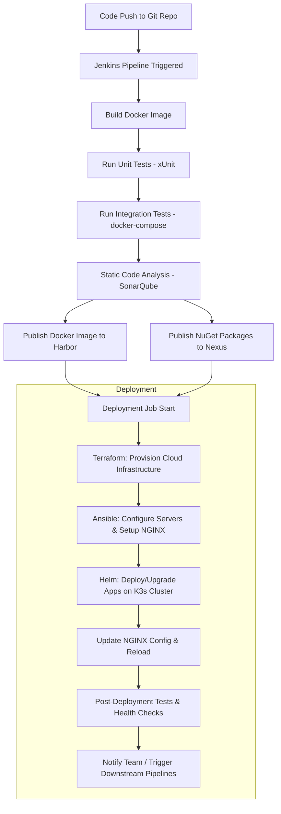

# PipelineValidation

A minimal C# console application project to validate CI/CD pipelines.

```mermaid
flowchart TD
    A[Code Push to Git Repo] --> B[Jenkins Pipeline Triggered]

    B --> C[Build Docker Image]
    C --> D[Run Unit Tests - xUnit]
    D --> E[Run Integration Tests - docker-compose]
    E --> F[Static Code Analysis - SonarQube]

    F --> G[Publish Docker Image to Harbor]
    F --> H[Publish NuGet Packages to Nexus]

    G --> I[Deployment Job Start]
    H --> I

    subgraph Deployment
      I --> J[Terraform: Provision Cloud Infrastructure]
      J --> K[Ansible: Configure Servers & Setup NGINX]
      K --> L[Helm: Deploy/Upgrade Apps on K3s Cluster]
      L --> M[Update NGINX Config & Reload]
      M --> N[Post-Deployment Tests & Health Checks]
      N --> O[Notify Team / Trigger Downstream Pipelines]
    end
```
